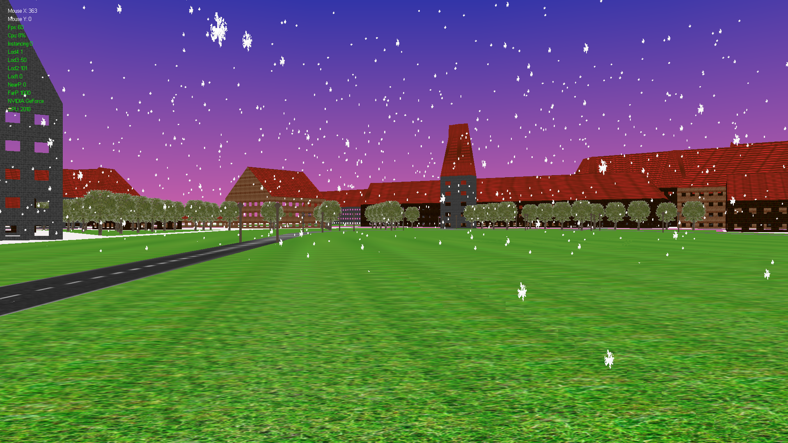
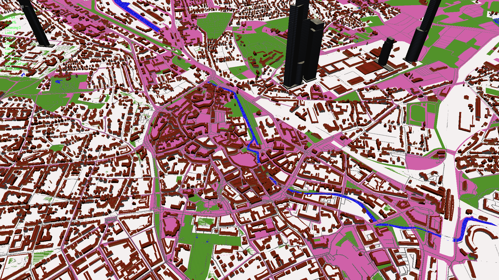

# ProceduralCity
Graphical application that visualizes OSM geodata using procedural generation.

This work has been created in cooperation with the [OSMConverter](https://github.com/ArielMant0/osmconverter) project.

### Example Pictures

